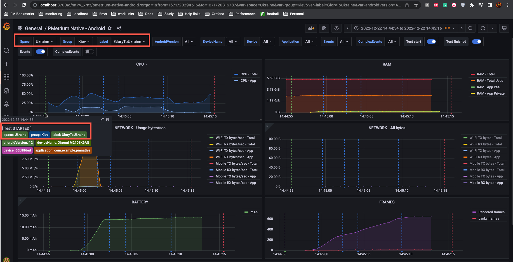

PMetrium Native supports Swagger UI available by `http://localhost:7777/swagger/index.html`

### GET `/HealthCheck/Android`

Endpoint allows us to verify that PMetrium Native Host has been started successfully and that we could execute performance tests for Android. Example:

```bash
> curl http://localhost:7777/HealthCheck/Android
```
    
### GET `/HealthCheck/IOS`

Endpoint allows us to verify that PMetrium Native Host has been started successfully and that we could execute performance tests for IOS. Example:

```bash
> curl http://localhost:7777/HealthCheck/IOS
```

### GET `/Android/Start`

Endpoint is responsible for sending a signal to the PMetrium Native framework to start a performance test pushing scripts to the device and executing them. Example:

```bash
> curl -G  -d "device=YourAndroidDeviceName" -d "applicationName=com.example.pmnative" http://localhost:7777/Android/Start
```

| Parameter name  | Type   | Required |
|-----------------|--------|----------|
| device          | string | yes      |
| applicationName | string | no       |
| cpuApp          | bool   | no       |
| cpuTotal        | bool   | no       |
| ramTotal        | bool   | no       |
| ramApp          | bool   | no       |
| networkTotal    | bool   | no       |
| networkApp      | bool   | no       |
| batteryApp      | bool   | no       |
| framesApp       | bool   | no       |
| space           | string | no       |
| group           | string | no       |
| label           | string | no       |

Example of disabling `cpuTotal` metric:
```bash
> curl -G  -d "device=YourAndroidDeviceName" -d "applicationName=com.example.pmnative" -d "cpuTotal=false" http://localhost:7777/Android/Start
```

:::caution 
By default, **all metrics** will be gathered. You could use optional parameters to explicitly turn off specified metrics.
:::

In case you would like to add some tags for additional quering your metrics in Grafana you may use next optional parameters:
- `space`
- `group`
- `label`

Example:

```bash
> curl -G \
    -d "device=YourAndroidDeviceName" \
	-d "applicationName=com.example.pmnative" \ 
	-d "space=Ukraine" \ 
	-d "group=Kiev" \ 
	-d "label=GloryToUkraine" \ 
	http://localhost:7777/Android/Start
```

Result:



### GET `/Android/Stop`

Endpoint is responsible for sending a signal to the PMetrium Native framework that the performance test has ended and the framework is ready to proceed with parsing of gathered metrics. Example: 

```bash
> curl -G -d "device=YourAndroidDeviceName" http://localhost:7777/Android/Stop
```

### GET `/IOS/Start`

Endpoint is responsible for sending a signal to the PMetrium Native framework to start a performance test for IOS device. Example:

```bash
> curl -G  -d "device=YourIOSDeviceName" -d "applicationName=PM-Native" http://localhost:7777/IOS/Start
```

| Parameter name  | Type   | Required |
|-----------------|--------|----------|
| device          | string | yes      |
| applicationName | string | no       |
| space           | string | no       |
| group           | string | no       |
| label           | string | no       |

`space`, `group` and `label` have the same meaning as for Android and will affect only IOS metrics and Grafana Dashboard. 

Please also note, that `applicationName` here means `udid` of the IOS device

### GET `/IOS/Stop`

Endpoint is responsible for sending a signal to the PMetrium Native framework that the performance test has ended and the framework is ready to proceed with parsing metrics. Example:

```bash
> curl -G -d "device=YourIOSDeviceName" http://localhost:7777/IOS/Stop
```