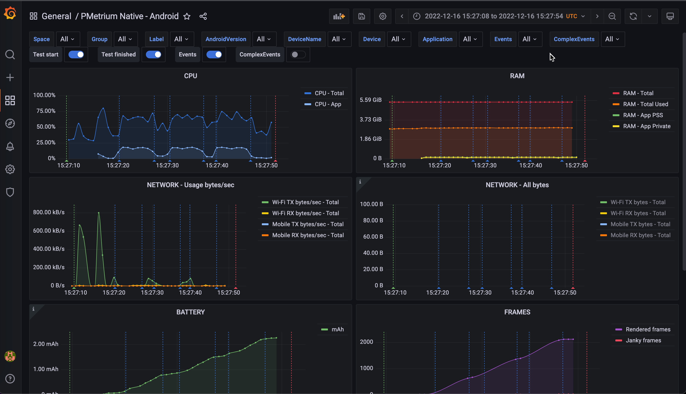

### Run performance test

0. It's expected that you've already completed the steps described in **[Prepare Workstation](./00-prepare-workstation.md)** and **[Prepare Device](./01-prepare-device.md)**
1. Get unic identifier of your device:

    ``` bash title=Android
    > adb devices
    ```
    
    
    ``` bash title=IOS 
    > xctrace list devices
    ```
    

    
2. You have to know the native app name as it's going to be used as a parameter for PMetrium Native endpoint. For example, `com.example.pmnative` for Android and `PM-Native` for IOS in our case. You may ask your developers to help you with this.

3. Start performance metrics measurement:

    ```bash title=Android
    curl -G -d "device=192.168.0.103:5555" -d "applicationName=com.example.pmnative" http://localhost:7777/Android/Start
    ```
   
    ```bash title=IOS
    curl -G -d "device=d9154d4020484cedde651473b2ae3b87c42ab8c1" -d "applicationName=PM-Native" http://localhost:7777/IOS/Start
    ```
    :::danger Please note
    From time to time `xctrace` cannot find device connected to your machine on the first try. You may try to repeat the call to `http://localhost:7777/IOS/Start`
    :::
  
    
    :::tip
    Read more about **[PMetrium Native Api](../architecture/03-development/04-pmetrium-api.md)**
    :::

4. Run functional test, for example (This test is not present in GitHub repository, replace this line with your own or perform manual test):

    ```bash
    dotnet test .\src\PMetrium.Native\FunctionalTests --filter ColdStart
    ```

5. Once the functional test is over you have to run the next command in order to stop measurement:

    ```bash title=Android
    curl -G -d "device=192.168.0.103:5555" http://localhost:7777/Android/Stop
    ```
   
    ```bash title=IOS
    curl -G -d "device=d9154d4020484cedde651473b2ae3b87c42ab8c1" http://localhost:7777/IOS/Stop
    ```

    :::danger Please note
    From time to time `xctrace` cannot finish the recording and save results to `.trace` file. In this case you need to repeat your test.
    :::

    :::tip
    All three commands may be organized into bat or shell script not to be called manually, for example, bat file:

    ```bash title=demo.bat
    curl -G -d "device=192.168.0.103:5555" -d "applicationName=com.example.pmnative" http://localhost:7777/Android/Start

    dotnet test .\src\PMetrium.Native\FunctionalTests  --filter ColdStart

    curl -G -d "device=192.168.0.103:5555" http://localhost:7777/Android/Stop
    ```
    :::

6. Open grafana in the browser: `http://localhost:3000` and check the results, you should see something like this:

    :::caution attention
    Grafana credentials:
    - Login: **admin**
    - Password: **admin**
    :::

    

### Run from code
Using `CURL` is not a requirement. You can just integrate the interaction with the PMetrium Native server into your functional tests framework. Let's look at the example of such functional autotest for native application on C# (programming language here does not matter):

```csharp
using System;
using System.Collections.Generic;
using System.Net.Http;
using System.Threading;
using System.Threading.Tasks;
using FunctionalTests.Helpers;
using Microsoft.AspNetCore.WebUtilities;
using NUnit.Framework;
using OpenQA.Selenium;

namespace FunctionalTests;

public class AndroidTests
{
    private HttpClient _httpClient;

    [OneTimeSetUp]
    public void OneTimeSetUp()
    {
        AppiumFacade.StartAppiumServer();
        _httpClient = new HttpClient();
    }

    [SetUp]
    public async Task SetUp()
    {
        var query = new Dictionary<string, string>()
        {
            ["device"] = "192.168.0.103:5555",
            ["applicationName"] = "com.example.pmnative"
        };

        var uri = QueryHelpers.AddQueryString("http://localhost:7777/Android/Start", query);
        await _httpClient.GetAsync(uri);
    }

    [TearDown]
    public async Task TearDown()
    {
        var query = new Dictionary<string, string>()
        {
            ["device"] = "192.168.0.103:5555",
        };

        var uri = QueryHelpers.AddQueryString("http://localhost:7777/Android/Stop", query);
        await _httpClient.GetAsync(uri);
    }

    [Test]
    public async Task MyAwesomeTest()
    {
        var driver = AppiumFacade.ProvideAndroidDriver();

        // you code for functional test
        // ...
        // ...

        driver.Quit();
    }
}
```

So all the communication is done throught `HttpClient` and the NUnit abilities with `[SetUp]` and `[TearDown]`